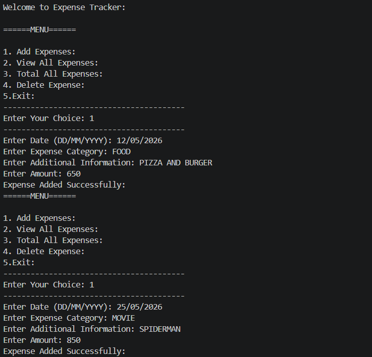
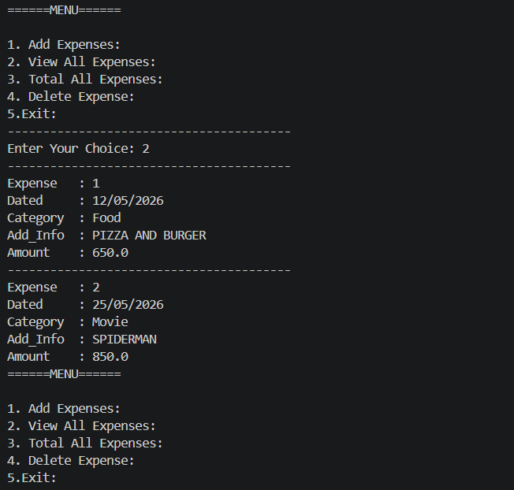
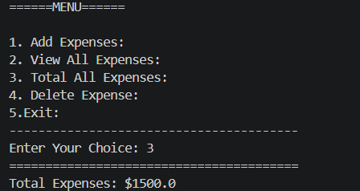
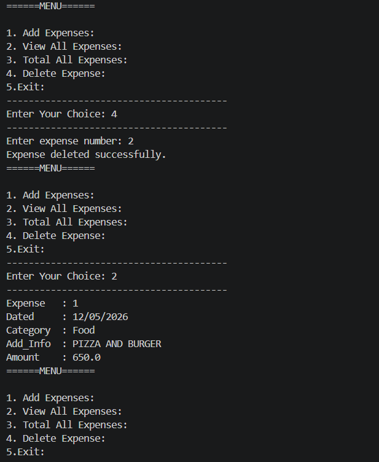

# 🧾 Expense Tracker

A simple command-line **Expense Tracker** built with Python to help users record and manage their daily expenses. This project provides a menu-driven interface where users can add, view, calculate, and delete expense records while practicing Python fundamentals.

---

## 📌 Project Overview

The Expense Tracker is designed as a beginner-friendly Python project to strengthen programming fundamentals through real-world implementation. It demonstrates how data can be stored using dictionaries and lists while applying functions, loops, conditional statements, and exception handling.

---

## ✨ Features

- ➕ Add new expenses
- 📋 View all saved expenses
- 💰 Calculate total expenses
- 🗑️ Delete an expense
- ✅ Input validation using exception handling
- 📑 Menu-driven interface

---

## 🛠️ Skills & Concepts Used

- Python
- Functions
- Lists
- Dictionaries
- Loops (`for`, `while`)
- Conditional Statements (`if`, `elif`, `else`)
- Exception Handling (`try-except`)
- User Input Handling
- Menu-Driven Programming
- Data Organization

---

## 📂 Project Structure

```text
01_Expense_Tracker_Project/
│
├── expense_tracker.py
├── README.md
└── 02_Output_Screenshots/
    ├── main-menu.png
    ├── add-expense.png
    ├── view-expenses.png
    ├── total-expenses.png
    └── delete-expense.png
```

---

## 📷 Project Output

### Add Expense



---

### View Expenses



---

### Total Expenses



---

### Delete Expense



---

## 🚀 How to Run

1. Clone the repository.
2. Open the project folder.
3. Run the Python file:

```bash
python expense_tracker.py
```
---

## 🎯 Learning Outcomes

Through this project, I practiced:

- Writing modular code using functions
- Organizing data with lists and dictionaries
- Handling user input safely
- Implementing exception handling
- Building a menu-driven command-line application
- Improving code readability and structure

---

## 📈 Future Improvements

- Save expenses to a JSON or CSV file
- Edit existing expenses
- Search expenses by category
- Filter expenses by date
- Generate expense reports
- Display category-wise summaries

---

## 👨‍💻 Author

**ZAKI SHAH**

GitHub: https://github.com/your-username

---

⭐ If you found this project helpful, feel free to give it a star!
